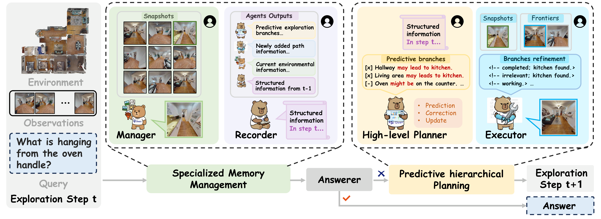

# Pred-EQA

[](https://cvpr.thecvf.com/)
[](https://cvpr.thecvf.com/virtual/2026/poster/37489)
[](https://github.com/yuanrr/Pred-EQA)

This repository contains the official implementation of **"Predict Before You Explore: Predictive Planning with Specialized Memory for Embodied Question Answering"** (CVPR 2026).

> Bowen Yuan, Sisi You, Bing-Kun Bao

> Nanjing University of Posts and Telecommunications, Hefei University of Technology

## Overview

Embodied Question Answering (EQA) requires agents to navigate 3D environments, accumulate visual evidence, and reason over partial observations to answer questions. Current agents struggle with two key challenges: planning remains **reactive** without long-horizon coherence, and **monolithic memories** entangle all observations, hindering retrieval of sparse but crucial evidence.

<p align="center">
  
</p>

We reframe EQA through the lens of **predictive processing**, where coherent behavior emerges from a *prediction–correction loop* grounded in stable priors. **Pred-EQA** instantiates this idea with two jointly designed mechanisms:

- **Predictive Hierarchical Planning**: A high-level planner predicts where question-relevant evidence is likely to appear and generates a compact set of actionable exploration branches encoding long-horizon intent. A low-level executor then reduces uncertainty within each branch and prunes/revises predictions when they fail.
- **Functionally Specialized Memory**: A dual-memory system separates a slowly evolving **textual structural memory** (stable spatial/semantic priors) from a compact **visual evidence memory** (only question-relevant observations), enabling consistent planning and efficient retrieval.

Through this prediction-guided exploration, Pred-EQA produces coherent trajectories under partial observability and achieves state-of-the-art results in both accuracy and exploration efficiency.


## Results

Pred-EQA is a **pure VLM pipeline** (frontier-based exploration, no scene graph or object detector) and is evaluated on **A-EQA** (a subset of OpenEQA) and **Express-Bench**, both built on HM3D.

### A-EQA (subset of OpenEQA)

| Method | VLM | LLM-Match ↑ | LLM-SPL ↑ |
|---|---|---|---|
| 3D-Mem | GPT-4o | 52.6 | 42.0 |
| MTU3D | GPT-4o | 51.1 | 42.6 |
| **Pred-EQA** | Qwen2.5-VL 7B | 46.2 | 37.8 |
| **Pred-EQA** | Qwen3-VL 8B | **53.3** | **48.5** |

### Express-Bench

| Method | VLM | C ↑ | C* ↑ | E_path ↑ | d_T ↓ |
|---|---|---|---|---|---|
| ToolEQA | Qwen2.5-VL 7B† | 42.21 | 65.77 | 25.82 | 5.25 |
| **Pred-EQA** | Qwen2.5-VL 7B | 47.44 | 68.54 | 34.31 | 5.80 |
| **Pred-EQA** | Qwen3-VL 8B | **52.58** | **70.54** | **47.66** | 5.64 |

`LLM-Match` measures answer accuracy and `LLM-SPL` measures accuracy weighted by exploration length. For Express-Bench, `C*` reflects answer accuracy, `C` / `E_path` jointly capture accuracy and exploration efficiency with visual-evidence consistency, and `d_T` is the mean geodesic distance to the goal. Pred-EQA scales favorably with model size (Qwen2.5-VL 3B/7B/32B and Qwen3-VL 4B/8B/30B/32B); see the paper for the full tables and ablations.

## Installation

Set up the conda environment (Linux, Python 3.9), following the [3D-Mem](https://github.com/UMass-Embodied-AGI/3D-Mem) setup that this codebase builds upon:

```bash
conda create -n pred-eqa python=3.9 -y && conda activate pred-eqa

pip install torch==2.0.1 torchvision==0.15.2 --index-url https://download.pytorch.org/whl/cu118
conda install -c conda-forge -c aihabitat habitat-sim=0.2.5 headless faiss-cpu=1.7.4 -y
conda install https://anaconda.org/pytorch3d/pytorch3d/0.7.4/download/linux-64/pytorch3d-0.7.4-py39_cu118_pyt201.tar.bz2 -y

pip install omegaconf==2.3.0 supervision==0.21.0 opencv-python-headless==4.10.* \
 scikit-learn==1.4 scikit-image==0.22 open3d==0.18.0 hipart==1.0.4 openai==1.35.3 httpx==0.27.2
```

## Preparations

### Dataset
Download the train and val splits of [HM3D](https://aihabitat.org/datasets/hm3d-semantics/) and set `scene_data_path` in `cfg/eval_pred_eqa.yaml` (e.g. `/your_path/hm3d/` containing `train/` and `val/`). The scene dataset config and question files are provided under `data/`:

- A-EQA questions: `data/aeqa_questions-41.json`, `data/aeqa_questions-184.json`
- Express-Bench questions: `data/express-bench.json`
- Ground-truth path lengths / baseline metrics for scoring: `data/gt_path_length.json`, `data/open-eqa-*-gpt-4o-1234-metrics.json`

Select the dataset by editing `questions_list_path` in `cfg/eval_pred_eqa.yaml`.

### VLM Serving (vLLM)
Pred-EQA queries a locally served VLM through an OpenAI-compatible API. By default the client connects to `http://0.0.0.0:22002/v1` (see `src/pred_eqa.py`). Launch the model with vLLM, e.g. Qwen3-VL-8B-Instruct:

```bash
CUDA_VISIBLE_DEVICES=6,7 python -m vllm.entrypoints.openai.api_server \
  --model /path/to/Qwen3-VL-8B-Instruct \
  --served-model-name Qwen3-VL-8B-Instruct \
  --tensor-parallel-size 2 \
  --host 0.0.0.0 --port 22002 \
  --dtype bfloat16 \
  --gpu-memory-utilization 0.85 \
  --max-model-len 32768 \
  --seed 3407
```


## Run Evaluation

### A-EQA

Generate predictions (the script reads the config via `-cf`/`--cfg_file`, defaults to `cfg/eval_pred_eqa.yaml`):

```bash
CUDA_VISIBLE_DEVICES=0 python run_aeqa_evaluation_vlm_only.py \
  -cf cfg/eval_pred_eqa.yaml \
  --qwen Qwen3-VL-8B-Instruct
```

To split tasks across runs, add `--start_ratio` and `--end_ratio`, e.g. evaluate the first half:

```bash
python run_aeqa_evaluation_vlm_only.py -cf cfg/eval_pred_eqa.yaml --start_ratio 0.0 --end_ratio 0.5
```

Predictions, trajectories, snapshots, and per-episode logs are written under `results/Pred-EQA/`. Then score the predictions in two steps — first compute the LLM-Match metrics, then aggregate LLM-Match / LLM-SPL:

```bash
# 1) LLM-match scoring (uses OpenEQA's GPT-based matcher; needs an LLM endpoint)
python evaluate-predictions.py \
  --results results/Pred-EQA/gpt_answer.json \
  --dataset data/open-eqa-41.json \
  --output-directory results/metrics \
  --force

# 2) Aggregate LLM-Match and LLM-SPL (by category and overall)
python get-scores.py \
  --result-path results \
  --dataset open-eqa-41 \
```

`--only-evaluated` scores only the questions that were actually run; omit it to fall back to the Blind-LLM baseline for missing questions (use `--start-ratio`/`--end-ratio` to score a subset).

### Express-Bench

Use the Express-Bench runner and its dedicated evaluation/scoring scripts:

```bash
# 1) Run exploration + answering on Express-Bench
python run_express_bench_evaluation_vlm_only.py -cf cfg/eval_pred_eqa.yaml --qwen Qwen3-VL-8B-Instruct

# 2) Evaluate answers (image alignment + accuracy) with the Express-Bench protocol
python evaluate_express_bench.py \
  --result-dir results/Pred-EQA \
  --questions-file data/express-bench.json

# 3) Compute C, C*, E_path, d_T
python get_scores_express_bench.py \
  --evaluation-file results/Pred-EQA/express_bench_evaluation_results.json
```

Remember to point `questions_list_path` to `data/express-bench.json` in the config first.


## Repository Structure

```
run_aeqa_evaluation_vlm_only.py          # A-EQA exploration + answering pipeline
run_express_bench_evaluation_vlm_only.py # Express-Bench pipeline
evaluate-predictions.py / get-scores.py  # A-EQA LLM-Match / LLM-SPL scoring
evaluate_express_bench.py / get_scores_express_bench.py  # Express-Bench scoring
src/
  pred_eqa.py            # Predictive planning loop + VLM client (port 22002)
  scene_vlm_only.py      # Pure-VLM scene / snapshot management
  long_term_memory.py    # Textual structural memory
  scene_integration.py   # Memory integration
  tsdf_planner.py        # TSDF-based frontier extraction & planning
  query_vlm.py           # Per-step VLM querying
cfg/                     # Evaluation configs
data/                    # Question files, GT path lengths, baseline metrics
prompts/                 # Agent / evaluation prompts
openeqa/                 # OpenEQA LLM-match evaluation utilities
```

## Acknowledgement

The codebase is built upon [3D-Mem](https://github.com/UMass-Embodied-AGI/3D-Mem), [OpenEQA](https://github.com/facebookresearch/open-eqa), [Explore-EQA](https://github.com/Stanford-ILIAD/explore-eqa), and [Express-Bench](https://github.com/HCPLab-SYSU/EXPRESS-Bench). We thank the authors for their great work.

## Citation

If you find this work useful for your research, please cite:

```bibtex
@inproceedings{yuan2026predeqa,
  title={Predict Before You Explore: Predictive Planning with Specialized Memory for Embodied Question Answering},
  author={Yuan, Bowen and You, Sisi and Bao, Bing-Kun},
  booktitle={Proceedings of the IEEE/CVF Conference on Computer Vision and Pattern Recognition (CVPR)},
  year={2026},
  pages={29610-29619}
}
```

## Contact

For questions or issues, please feel free to open an issue or contact the authors directly at yuanbw0925@gmail.com.

## License

This project is released under the [MIT License](LICENSE).
